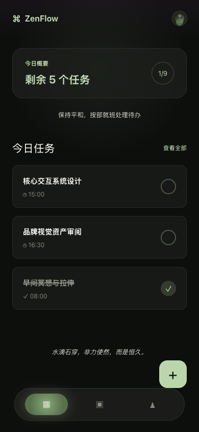
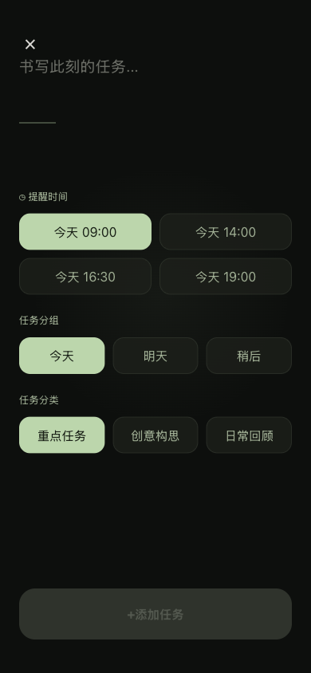
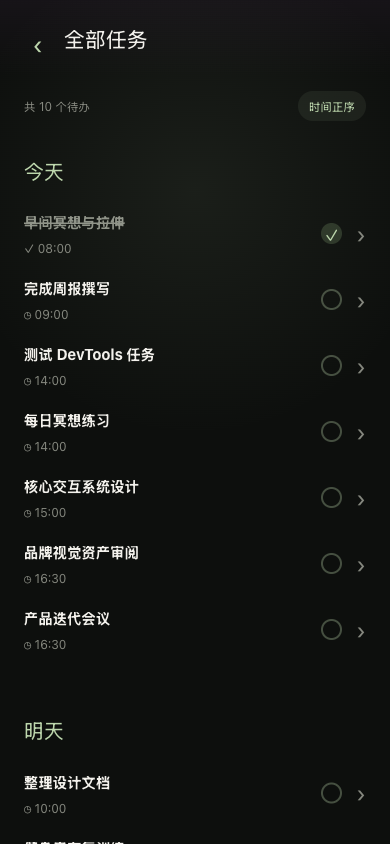
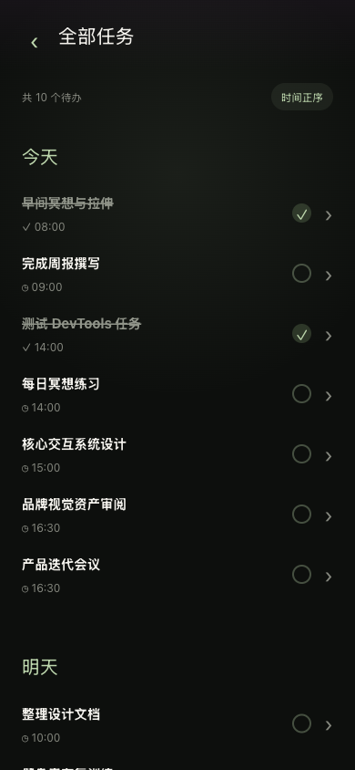
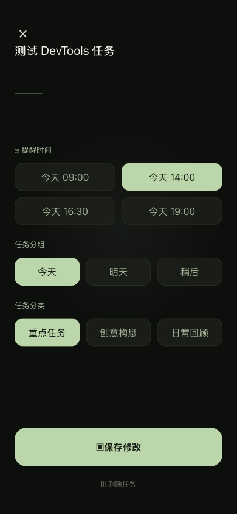
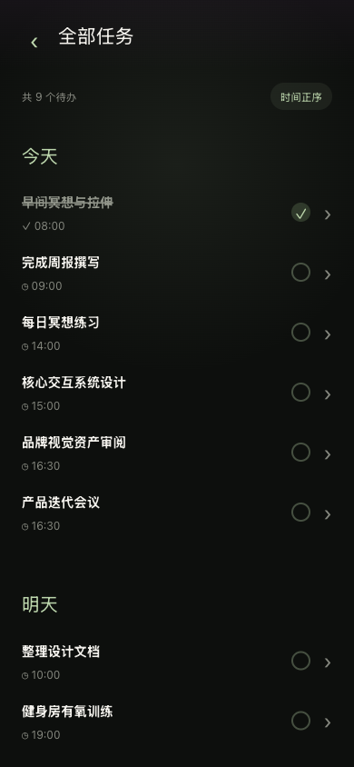
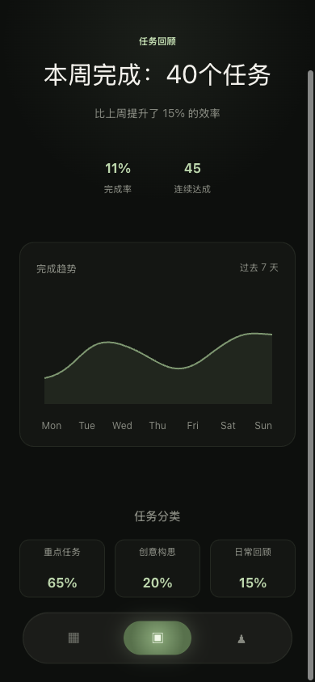
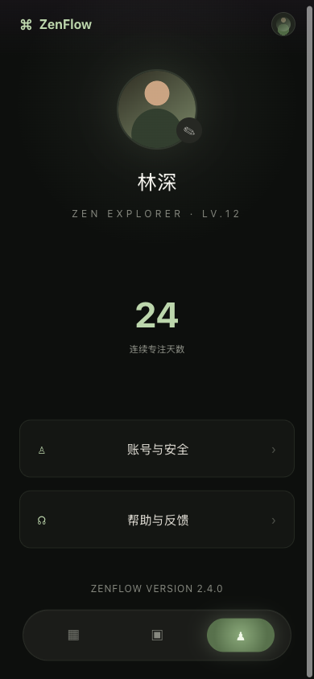

# 🌿 ZenFlow 浏览器端到端自动化测试报告 (E2E)

本报告由 Puppeteer 驱动的自动化测试脚本在已开启的 Chrome 浏览器中运行并生成。测试覆盖了核心的交互操作以及页面跳转。

## 📊 测试结论

- **测试状态**：✨ **PASSED** (所有 9 个测试步骤全部通过)
- **测试模式**：`autoConnect` 模式（成功连接至正在运行的 IDE Chrome 实例 `127.0.0.1:9222`）
- **测试环境**：
  - 测试端口：`http://localhost:5188` (Vite 自动启动/停止)
  - 模拟设备：iPhone 12 / 13 Pro (Viewport: 390x844)

---

## 📸 测试步骤与截图

以下展示了测试过程中的完整流程及对应阶段的浏览器截图：

### Step 1: 首页加载
首页成功加载，品牌名 `ZenFlow`、今日概要进度以及任务卡片均能正常展现。


---

### Step 2: 全部任务页跳转
点击首页的“查看全部”按钮，成功跳转到 `#/tasks`，显示分组任务列表。


---

### Step 3: 新增任务页
返回首页并点击右下角 `+` 悬浮按钮，成功跳转到 `#/new`，输入框占位符和选项配置均渲染良好。


---

### Step 4: 新建任务提交
输入任务名称 `"测试 DevTools 任务"` 并选择提醒时间为 `"今天 14:00"`，点击“添加任务”后，系统成功返回全部任务页，且新任务排在列表首位。


---

### Step 5: 切换任务状态
点击测试任务右侧的圆形勾选框，任务标题立刻被添加删除线，文字变灰，成功标记为已完成。


---

### Step 6: 任务编辑页
点击该任务文字区域，路由自动切换到 `#/edit/:id`，并带入之前的标题、时间及分组数据。


---

### Step 7: 删除任务
点击编辑页面下方的“Ⅲ 删除任务”按钮，任务被成功删除并返回全部任务页，列表中已无该任务。


---

### Step 8: 任务统计页
点击底部导航栏“统计”按钮，路径切换到 `#/stats`，本周完成数、提升比例以及过去 7 天的趋势图正常显示。


---

### Step 9: 个人中心页
点击底部导航栏“我的”按钮，路径切换到 `#/profile`，展示用户昵称「林深」和各项设置选项。


---

## 🛠️ 测试运行与重试

如果您需要在本地再次运行此测试，只需确保您的开发环境中启动了能够接受调试连接的 Chrome (默认端口 9222)，然后在项目根目录下运行：

```bash
npm run test:e2e
```
